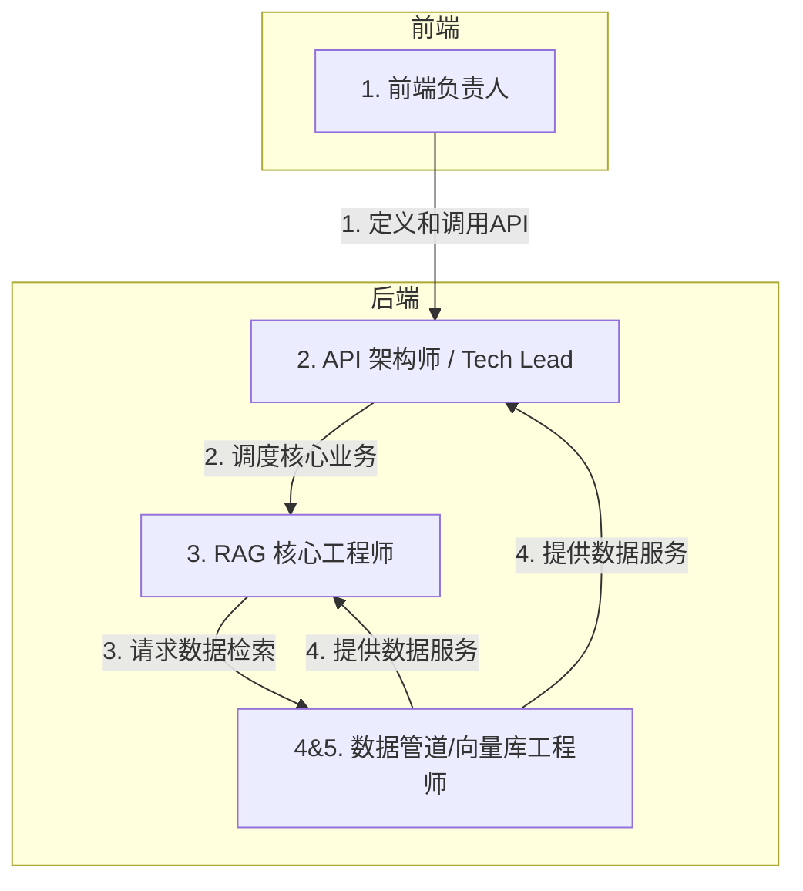

### 模型一：职能驱动型分工 (推荐)

这个模型按照项目的功能模块进行划分，每个人都有一个非常明确的核心职责领域。

#### 角色 1: 前端开发负责人 (Frontend Lead) - 1人

* **核心职责**:
  * 全权负责 `frontend/` 目录下的所有开发工作。
  * 实现用户界面、交互逻辑、状态管理。
  * 与后端负责人对接，定义和调试 API 接口，确保前后端数据顺畅交互。
  * 负责前端项目的构建、打包和部署。
* **关联文件**: `frontend/` 目录下的所有文件。
* **所需技能**: Vue.js, JavaScript/TypeScript, CSS, REST API 调用。

#### 角色 2: 后端 & API 架构师 (Backend & API Architect) - 1人

* **核心职责**:
  * 担任**项目技术负责人 (Tech Lead)** 的角色，对后端整体架构负责。
  * 设计和开发 API 接口层，即 `app/api/` 目录（`chat.py`, `document.py`）。定义清晰的 API 规范。
  * 管理项目配置 (`config.py`)、应用入口 (`run.py`) 和依赖 (`requirements.txt`)。
  * 负责后端的部署、日志记录和错误处理策略。
  * 协调后端其他成员的工作，确保代码风格和质量统一。
* **关联文件**: `run.py`, `config.py`, `app/api/*`, `requirements.txt`。
* **所需技能**: Python, Flask/FastAPI, REST API 设计, Git, Docker, CI/CD 基础。

#### 角色 3: RAG 核心与算法工程师 (RAG Core & Algorithm Engineer) - 1人

* **核心职责**:
  * 专注于整个 RAG 的“大脑”，即 `core/` 目录。
  * 负责 `rag_pipeline.py` 的实现，编排“检索-增强-生成”的完整流程。
  * 负责 `llm_handler.py`，封装对大语言模型的调用，进行 Prompt Engineering 调优。
  * 研究和优化检索算法的准确性，评估 RAG 的回答质量。这是项目的效果核心。
* **关联文件**: `app/core/rag_pipeline.py`, `app/core/llm_handler.py`。
* **所需技能**: Python, 对 RAG/LLM 原理有深入理解, Prompt Engineering, 算法思维。

#### 角色 4 & 5: 数据管道与向量库工程师 (Data Pipeline & Vector Store Engineers) - 2人

这两个人共同负责数据的“入口”和“存储”，这是 RAG 效果的基础。他们的工作可以进一步细分，也可以互相备份。

* **核心职责**:
  * **数据预处理与入库**: 负责 `scripts/ingest_data.py` 脚本的开发和维护，处理离线数据构建。
  * **文档处理服务**: 负责 `services/document_service.py`，实现对各种文档格式（PDF, Word, etc.）的解析、清洗和文本块切分 (Chunking)。这是保证检索质量的关键一步。
  * **向量数据库管理**: 负责 `services/vector_store_service.py`，封装对向量数据库（Chroma, FAISS等）的增、查操作。负责数据库的选型、性能调优和维护。
  * **实时更新流程**: 实现用户上传新文件后，将其处理并实时添加到向量数据库的逻辑。
* **关联文件**: `data/*`, `scripts/ingest_data.py`, `app/services/*`。
* **所需技能**: Python, 数据处理与清洗, 熟悉至少一种向量数据库, 文件解析库 (如 PyPDF2)。

---

### 协作流程示意图

1. **前端负责人**与 **API 架构师** 沟通，确定需要哪些接口和数据格式。
2. **API 架构师** 接收到前端请求后，调用 **RAG 核心工程师** 编写的 `rag_pipeline`。
3. **RAG 核心工程师** 在流程中需要检索时，会调用 **数据管道/向量库工程师** 提供的 `vector_store_service`。
4. **数据管道/向量库工程师** 确保数据服务稳定高效，并为 **RAG核心工程师** 提供高质量的上下文数据。

---
